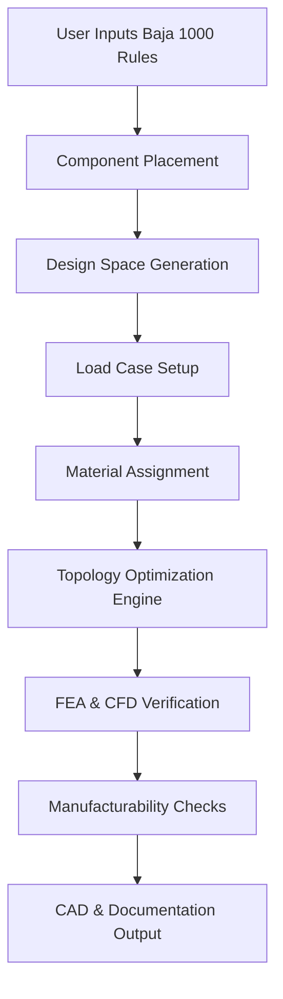

# Topology Optimization for a Carbon Fiber Trophy Truck Chassis in the Baja 1000

## Abstract
This document explores the application of topology optimization to design a carbon fiber chassis for a trophy truck competing in the Baja 1000. The objective is to achieve optimal drag coefficients, resistance, and stability under harsh desert racing conditions. The workflow integrates race rules, component packaging, load cases, and manufacturing constraints to generate a CAD‑ready design.

## Introduction
The Baja 1000 is one of the most demanding off‑road races in the world. Trophy trucks must balance speed, durability, and safety while navigating extreme terrain. Traditional chassis design often relies on iterative prototyping. Topology optimization offers a computational approach to derive the most efficient structure given constraints such as:
- Carbon fiber material properties
- Suspension and drivetrain packaging
- Aerodynamic drag and stability requirements
- Compliance with Baja 1000 regulations

## Methodology
The workflow follows these steps:
1. **Rules ingestion**: Parse Baja 1000 regulations for dimensional and safety constraints.
2. **Component placement**: Define bounding boxes for motor, transmission, suspension, and safety cell.
3. **Design space generation**: Establish keep‑in and keep‑out zones.
4. **Load case setup**: Apply static, dynamic, and impact loads.
5. **Material assignment**: Carbon fiber laminates with metallic inserts for joints.
6. **Topology optimization**: Multi‑objective optimization for stiffness, weight, aero, and stability.
7. **Verification**: Finite element analysis (FEA) and computational fluid dynamics (CFD).
8. **Manufacturability checks**: Ply drapability, mold splits, and fastener maps.
9. **Output**: CAD geometry, layup schedules, and compliance reports.

## Workflow Diagram


## Implementation

This repository implements the complete workflow described above. The system is organized into modular components:

### Module Descriptions

#### 1. Rules Ingestion (`rules_ingestion.py`)
Parses and validates Baja 1000 race regulations including:
- Dimensional constraints (max length: 6.1m, max width: 2.5m)
- Safety requirements (roll cage, safety cell, harness points)
- Suspension requirements (travel limits, shock absorbers)
- Weight constraints and distribution
- Structural and material requirements
- Aerodynamic constraints

**Key Class**: `Baja1000Rules`
- Loads regulation database
- Validates design parameters against rules
- Exports compliance reports

#### 2. Component Placement (`component_placement.py`)
Manages the spatial arrangement of vehicle components:
- Engine and transmission bounding boxes
- Front and rear suspension packaging
- Safety cell volume requirements
- Fuel tank placement
- Interference detection between components

**Key Class**: `ComponentPlacer`
- Defines component bounding boxes in 3D space
- Validates fit within chassis envelope
- Generates packaging summary statistics

#### 3. Design Space Generation (`design_space.py`)
Establishes the optimization domain:
- Creates 3D grid representation of chassis volume
- Defines keep-out zones (occupied by components)
- Defines keep-in zones (required structural elements)
- Applies symmetry constraints for bilateral symmetry
- Calculates volume fractions

**Key Class**: `DesignSpaceGenerator`
- Generates discretized design space
- Manages spatial constraints
- Supports symmetry enforcement

#### 4. Load Case Setup (`load_cases.py`)
Configures structural loading conditions:
- Static cornering loads with lateral acceleration
- Jump landing impacts with vertical forces
- Torsional rigidity test loads
- Frontal impact crash loads
- Safety factors per load type

**Key Class**: `LoadCaseManager`
- Stores multiple load cases
- Applies boundary conditions
- Identifies critical load cases
- Scales loads based on material properties

#### 5. Material Assignment (`material_assignment.py`)
Handles composite material properties:
- Carbon fiber laminate specifications
- Ply orientations and stacking sequences
- Metallic inserts for bolted joints
- Classical Laminate Theory calculations
- Layup schedule generation

**Key Class**: `MaterialAssignment`
- Manages material properties (E, ν, ρ, strength)
- Generates symmetric stacking sequences
- Calculates effective laminate properties
- Exports manufacturing layup schedules

#### 6. Topology Optimization (`optimizer.py`)
Core optimization engine using SIMP method:
- Density-based topology optimization
- SIMP (Solid Isotropic Material with Penalization)
- Optimality criteria update method
- Density filtering to prevent checkerboarding
- Multi-load case compliance minimization
- Volume constraint enforcement

**Key Class**: `TopologyOptimizer`
- Initializes density field
- Iterates optimization steps
- Applies sensitivity filtering
- Enforces design constraints
- Extracts final geometry

#### 7. Verification (`verification.py`)
Validates structural and aerodynamic performance:

**FEA Verification**:
- Static stress analysis (von Mises stress, displacement)
- Modal analysis (natural frequencies, mode shapes)
- Stiffness calculations (torsional, bending)
- Safety factor evaluation

**CFD Verification**:
- Drag coefficient calculation
- Lift/downforce analysis
- Frontal area computation
- Stability derivatives
- Aerodynamic optimization suggestions

**Key Classes**: `FEAVerification`, `CFDVerification`

#### 8. Manufacturability Checks (`manufacturability.py`)
Ensures design can be manufactured:
- Ply drapability analysis (curvature limits)
- Mold split line recommendations
- Thickness consistency validation
- Fastener location mapping
- Overhang angle detection (support structure needs)

**Key Class**: `ManufacturabilityChecker`
- Validates manufacturing constraints
- Identifies problem areas
- Generates fastener maps
- Provides production recommendations

#### 9. CAD & Documentation Output (`cad_output.py`)
Generates manufacturing deliverables:
- STEP file export (AP214 format)
- STL file export (binary/ASCII)
- IGES file export
- Layup schedule documentation
- Compliance report generation
- Complete manufacturing package assembly

**Key Class**: `CADOutputGenerator`
- Exports CAD in multiple formats
- Generates human-readable documentation
- Creates compliance reports
- Packages all deliverables

### Main Workflow Orchestrator (`workflow.py`)

The `TopologyOptimizationWorkflow` class integrates all modules following the workflow diagram. It:

1. Initializes configuration parameters
2. Executes each step in sequence
3. Passes data between modules
4. Collects and reports results
5. Generates output files

**Usage Example**:
```python
from topology_optimization import TopologyOptimizationWorkflow

workflow = TopologyOptimizationWorkflow()
results = workflow.run(output_dir="output")
```

## Configuration System

The `OptimizationConfig` class provides comprehensive configuration through dataclasses:

### Chassis Dimensions
- Length, width, height (meters)
- Ground clearance requirements

### Material Properties
- Young's modulus, Poisson's ratio
- Density, strength values
- Ply thickness

### Optimization Objectives
- Target weight reduction (%)
- Minimum stiffness ratio (%)
- Maximum drag coefficient

### Baja 1000 Constraints
- Dimensional limits
- Safety cell volume
- Roll cage specifications

### Manufacturing Constraints
- Minimum member thickness
- Maximum overhang angle
- Minimum hole diameter

### Component and Load Case Lists
- Predefined component bounding boxes
- Standard load cases with safety factors
- Extensible for custom scenarios

## Outputs

The system generates a complete manufacturing package:

### CAD Files
1. **chassis.step** - Primary CAD model (STEP AP214)
2. **chassis.stl** - Mesh for visualization/FEA
3. **chassis.iges** - Alternative CAD format

### Documentation
1. **compliance_report.json** - Detailed rule compliance
2. **compliance_report.txt** - Human-readable summary
3. **layup_schedule.json** - Ply-by-ply manufacturing instructions
4. **README.txt** - Package overview

### Analysis Results
- Structural performance metrics
- Aerodynamic coefficients
- Manufacturing validation status
- Weight and stiffness values

## Technical Details

### Optimization Algorithm
The SIMP (Solid Isotropic Material with Penalization) method interpolates material stiffness as:

E(ρ) = E₀ · ρᵖ

Where:
- ρ is element density [0, 1]
- E₀ is base material stiffness
- p is penalty factor (typically 3)

The optimization minimizes compliance (maximize stiffness) subject to volume constraints using optimality criteria with bisection to find Lagrange multipliers.

### Filtering
Sensitivity filtering prevents checkerboard patterns and mesh-dependent solutions by averaging sensitivities over a neighborhood of elements.

### Symmetry
Bilateral symmetry (about XY plane) is enforced to reduce computation and match typical vehicle construction.

## Running the System

### Basic Usage
```bash
python examples.py basic
```

### Custom Configuration
```bash
python examples.py custom
```

### Advanced Example
```bash
python examples.py advanced
```

### All Examples
```bash
python examples.py all
```

## Results Interpretation

The workflow provides detailed output including:

1. **Weight Reduction**: Percentage of material removed vs. solid baseline
2. **Safety Factor**: Ratio of material strength to maximum stress
3. **Drag Coefficient**: Aerodynamic efficiency (lower is better)
4. **Torsional Stiffness**: Chassis rigidity (Nm/degree)
5. **Natural Frequencies**: Modal characteristics (Hz)
6. **Manufacturing Status**: Pass/fail for production readiness
7. **Compliance Status**: Pass/fail for race regulations

## Validation and Quality Assurance

The system includes multiple validation layers:

1. **Geometric Validation**: Component interference checking
2. **Structural Validation**: Safety factor verification
3. **Aerodynamic Validation**: Drag coefficient targets
4. **Manufacturing Validation**: Drapability and thickness checks
5. **Regulatory Validation**: Baja 1000 rule compliance

## Future Enhancements

Potential improvements include:

1. Integration with commercial FEA software (Abaqus, Ansys)
2. Integration with commercial CFD software (Star-CCM+, OpenFOAM)
3. Real surface extraction (marching cubes algorithm)
4. Advanced composite optimization (fiber orientation optimization)
5. Crash simulation and crashworthiness optimization
6. Thermal analysis for engine bay cooling
7. Vibration isolation optimization
8. Cost estimation and material selection

## Conclusion

This topology optimization system provides an end-to-end solution for designing carbon fiber trophy truck chassis for the Baja 1000. By integrating regulatory constraints, structural requirements, aerodynamic objectives, and manufacturing considerations, it produces optimized, compliant, and buildable designs ready for manufacturing.

The modular architecture allows for customization and extension while the comprehensive validation ensures race-ready performance and regulatory compliance.
