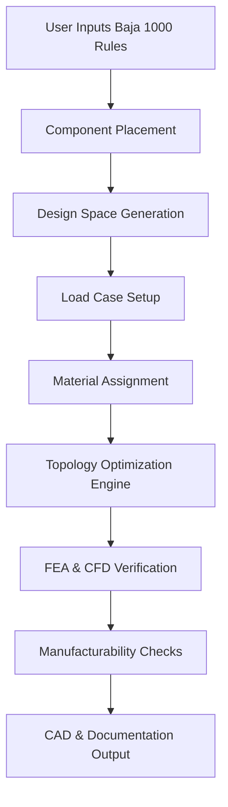

# Topology Optimization for Carbon Fiber Trophy Truck Chassis

## Overview

This repository contains a comprehensive topology optimization system for designing carbon fiber chassis for trophy trucks competing in the Baja 1000. The system integrates race regulations, component packaging, load cases, and manufacturing constraints to generate CAD-ready designs optimized for drag coefficients, resistance, and stability.

## Features

- **Rules Ingestion**: Parse and validate Baja 1000 regulations
- **Component Placement**: Define and manage bounding boxes for vehicle components
- **Design Space Generation**: Establish keep-in and keep-out zones
- **Load Case Setup**: Apply static, dynamic, and impact loads
- **Material Assignment**: Configure carbon fiber laminates with metallic inserts
- **Topology Optimization**: Multi-objective optimization using SIMP method
- **FEA & CFD Verification**: Structural and aerodynamic analysis
- **Manufacturability Checks**: Validate ply drapability, mold splits, and fastener maps
- **CAD Output**: Generate STEP, STL, and IGES files with documentation

## Workflow



## Installation

```bash
# Clone the repository
git clone https://github.com/THEDIFY/ENG.git
cd ENG

# Install dependencies
pip install -r requirements.txt
```

## Quick Start

### Basic Example

```python
from topology_optimization import TopologyOptimizationWorkflow

# Create and run workflow with default settings
workflow = TopologyOptimizationWorkflow()
results = workflow.run(output_dir="output")
```

### Custom Configuration

```python
from topology_optimization import TopologyOptimizationWorkflow, OptimizationConfig
from topology_optimization.config import LoadCase

# Create custom configuration
config = OptimizationConfig(
    chassis_length=6.0,
    chassis_width=2.4,
    target_weight_reduction=0.35,
    max_drag_coefficient=0.32,
)

# Add custom load case
extreme_landing = LoadCase(
    name="Extreme Landing",
    load_type="impact",
    forces={
        "front_left": (0, 0, -60000),
        "front_right": (0, 0, -60000),
    },
    safety_factor=3.0
)
config.load_cases.append(extreme_landing)

# Run workflow
workflow = TopologyOptimizationWorkflow(config)
results = workflow.run(output_dir="output/custom")
```

## Running Examples

```bash
# Run basic example
python examples.py basic

# Run custom configuration example
python examples.py custom

# Run advanced example with custom materials
python examples.py advanced

# Run all examples
python examples.py all
```

## Output Files

The workflow generates the following outputs:

### CAD Files
- `chassis.step` - Primary CAD file (STEP AP214 format)
- `chassis.stl` - Visualization and FEA mesh
- `chassis.iges` - Alternative CAD format

### Documentation
- `compliance_report.json` - Baja 1000 rule compliance
- `compliance_report.txt` - Human-readable compliance report
- `layup_schedule.json` - Carbon fiber layup instructions
- `README.txt` - Manufacturing package overview

## Configuration Options

### Chassis Dimensions
- `chassis_length` (default: 5.5m)
- `chassis_width` (default: 2.3m)
- `chassis_height` (default: 2.0m)

### Optimization Objectives
- `target_weight_reduction` (default: 0.3 = 30%)
- `min_stiffness_ratio` (default: 0.9 = 90%)
- `max_drag_coefficient` (default: 0.35)

### Material Properties
- Carbon fiber laminate with configurable properties
- Metallic inserts for joints (steel, aluminum, titanium)
- Custom layup schedules and ply orientations

### Load Cases
- Static cornering
- Jump landing impact
- Torsional rigidity
- Frontal impact
- Custom load cases

## Baja 1000 Compliance

The system validates designs against Baja 1000 regulations including:
- Maximum dimensions (6.1m × 2.5m × 2.5m)
- Minimum ground clearance (0.35m)
- Safety cell requirements
- Roll cage specifications
- Material approvals

## Technical Approach

### Topology Optimization
- SIMP (Solid Isotropic Material with Penalization) method
- Multi-objective optimization for stiffness, weight, and aerodynamics
- Density filtering to avoid checkerboard patterns
- Optimality criteria update method

### Verification
- FEA: Static analysis, modal analysis, stiffness calculations
- CFD: Drag coefficient, downforce, stability derivatives
- Manufacturing: Drapability, overhang angles, thickness validation

## Project Structure

```
ENG/
├── topology_optimization/
│   ├── __init__.py
│   ├── config.py                  # Configuration and data structures
│   ├── rules_ingestion.py         # Baja 1000 rules parser
│   ├── component_placement.py     # Component packaging
│   ├── design_space.py            # Design space generation
│   ├── load_cases.py              # Load case management
│   ├── material_assignment.py     # Material and layup schedules
│   ├── optimizer.py               # Topology optimization engine
│   ├── verification.py            # FEA and CFD analysis
│   ├── manufacturability.py       # Manufacturing validation
│   ├── cad_output.py              # CAD and documentation export
│   └── workflow.py                # Main workflow orchestrator
├── examples.py                     # Example usage scripts
├── requirements.txt                # Python dependencies
└── README.md                       # This file
```

## Requirements

- Python 3.7+
- NumPy >= 1.21.0
- SciPy >= 1.7.0

## License

See LICENSE file for details.

## Contributing

Contributions are welcome! Please feel free to submit pull requests or open issues for bugs and feature requests.

## References

- Baja 1000 Official Regulations
- SIMP Topology Optimization Method
- Classical Laminate Theory for Composites
- Carbon Fiber Manufacturing Best Practices

## Contact

For questions or support, please open an issue on GitHub.
